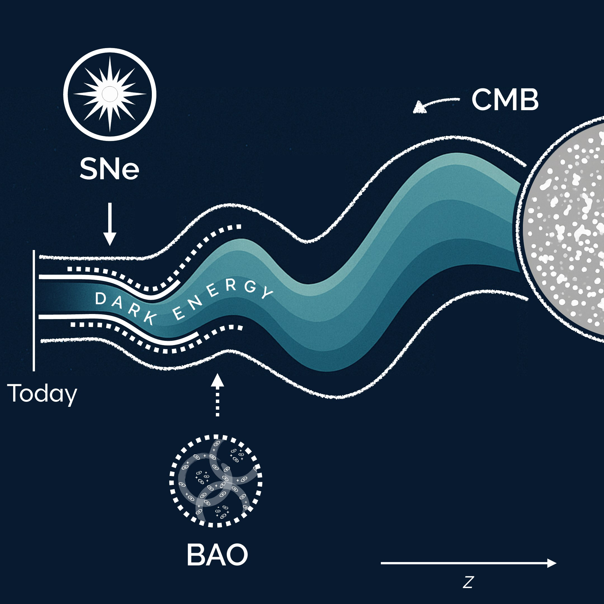
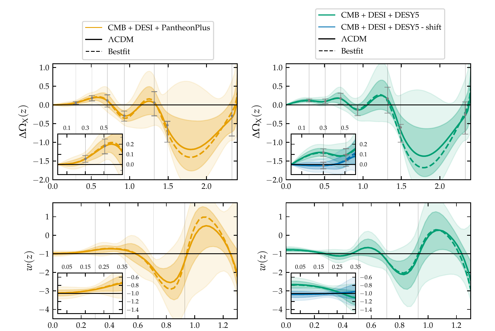
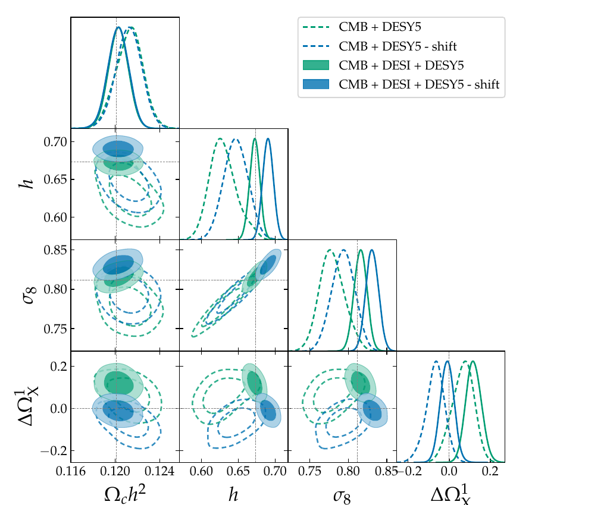

```{=html}
<div class="pagehead projhead">
  <figure class="cover">
    
    <figcaption>Cover art I designed for the journal issue featuring this work.</figcaption>
  </figure>
  <div>
    <div class="tags"><span class="tag">Bayesian inference</span><span class="tag">Splines</span><span class="tag">MCMC</span><span class="tag">Model validation</span></div>
    <h1><em>Is dark energy changing? Letting the data decide</em></h1>
    <p class="lead">A non-parametric Bayesian reconstruction of how the dark energy density evolves over cosmic time, fitted to the latest DESI baryon acoustic oscillation measurements. The method avoids assuming a functional form and lets the data decide.</p>
  </div>
</div>

```

## The problem

Since the accelerated expansion of the Universe was discovered in 1998, the standard model of cosmology has assumed that dark energy is a constant. In 2024 the DESI survey published new measurements that hinted otherwise, and the question became one of the most debated in the field.

Most analyses test this by choosing a specific formula for how dark energy could change, and fitting its parameters. The answer then depends on the formula. I wanted an approach closer to how a data scientist would treat an unknown function: **let the data determine the shape**, and measure how confident we can be in every part of it.

## What I built

**A flexible, non-parametric model.** I described the dark energy density as a smooth curve defined by a small number of control points (a cubic spline). The value at each control point is a free parameter learned from the data. I chose to model the quantity that the measurements are most directly sensitive to, which made the model both easier to constrain and easier to interpret.

**Data fusion across heterogeneous sources.** I combined three very different datasets in a single likelihood: the cosmic microwave background (the early Universe), distance measurements from DESI galaxy clustering, and two independent catalogues of supernovae. I wrote the likelihood for the DESI data and integrated everything into an existing scientific modelling pipeline.

**Bayesian inference at scale.** The full model has 14 parameters with strong correlations between them. I explored the posterior with an ensemble MCMC sampler, and cross-checked it with a second, independent algorithm (Metropolis–Hastings) plus a direct optimiser for the best fit. Every result comes with a full uncertainty band, not just a point estimate.

**Validation and robustness.** Before trusting the results, I checked the new pipeline against an independent, widely used code and recovered consistent answers. I then stress-tested the conclusions in two ways:

- **Overfitting:** a flexible model can fit noise. I compared an 8-point and a 4-point version of the model. The simpler one gave smoother curves with the same overall features, which tells us the signal is not an artefact of too much freedom.
- **Data quality:** an open question was whether a small subset of nearby supernovae carried a calibration offset. I applied the proposed correction to only those points and measured how much the conclusions moved.

## Results

```{=html}
<figure class="fig">
  
  <figcaption><b>The reconstructed history of dark energy.</b> Each panel shows the model's estimate (solid line) with 68% and 95% uncertainty bands, using one of the two supernova catalogues (left and right). The flat black line is what a constant dark energy would look like. Top: how far dark energy deviates from a constant at each epoch (later times on the left). Bottom: a derived quantity describing its behaviour.</figcaption>
</figure>
```

- **A mild preference for change.** The data favour a dark energy that evolves over time, but the evidence is moderate: about 2.4σ with one supernova catalogue and 1.3σ with the other. That is weaker than claimed with the simpler, fixed-formula approach. Choosing a more flexible model gives a more honest picture of the uncertainty.
- **Localising the signal.** Because the model estimates each epoch separately, I could see *where* the deviation comes from. For the stronger result, the evidence is driven almost entirely by a single point in the recent Universe. That is the kind of insight a single summary number would hide.

```{=html}
<figure class="fig narrow">
  
  <figcaption><b>Testing a suspected data issue.</b> Joint and marginal posterior distributions for key parameters, before (green) and after (blue) correcting a small group of nearby supernovae for a suspected calibration offset. The bottom-right panel is the parameter that drives the signal; the dotted line is the "constant dark energy" value.</figcaption>
</figure>
```

- **A small data issue can create a big signal.** Correcting the suspected offset in only the nearest supernovae was enough to remove the tension completely: the key parameter moved from 3σ away from the standard value to fully consistent with it. The correction also shifted other parameters, showing the trade-off it introduces. This is a concrete example of why auditing input data matters as much as the model.

## Techniques

```{=html}
<div class="skills">
  <div><h4>Modelling</h4><p>Non-parametric regression with splines, choosing an interpretable target variable, controlling model complexity.</p></div>
  <div><h4>Inference</h4><p>Bayesian analysis, MCMC in high dimensions, convergence and sampler cross-checks, uncertainty quantification.</p></div>
  <div><h4>Data</h4><p>Combining heterogeneous datasets in one likelihood, detecting and testing systematic errors.</p></div>
  <div><h4>Engineering</h4><p>Extending a large scientific codebase, writing custom likelihoods, validating against reference tools.</p></div>
</div>

<a class="btn paperbtn" href="https://journals.aps.org/prd/abstract/10.1103/dj3k-84v4">Read the full paper</a>
<br>
<a class="backlink" href="../projects.html">← All projects</a>
```
