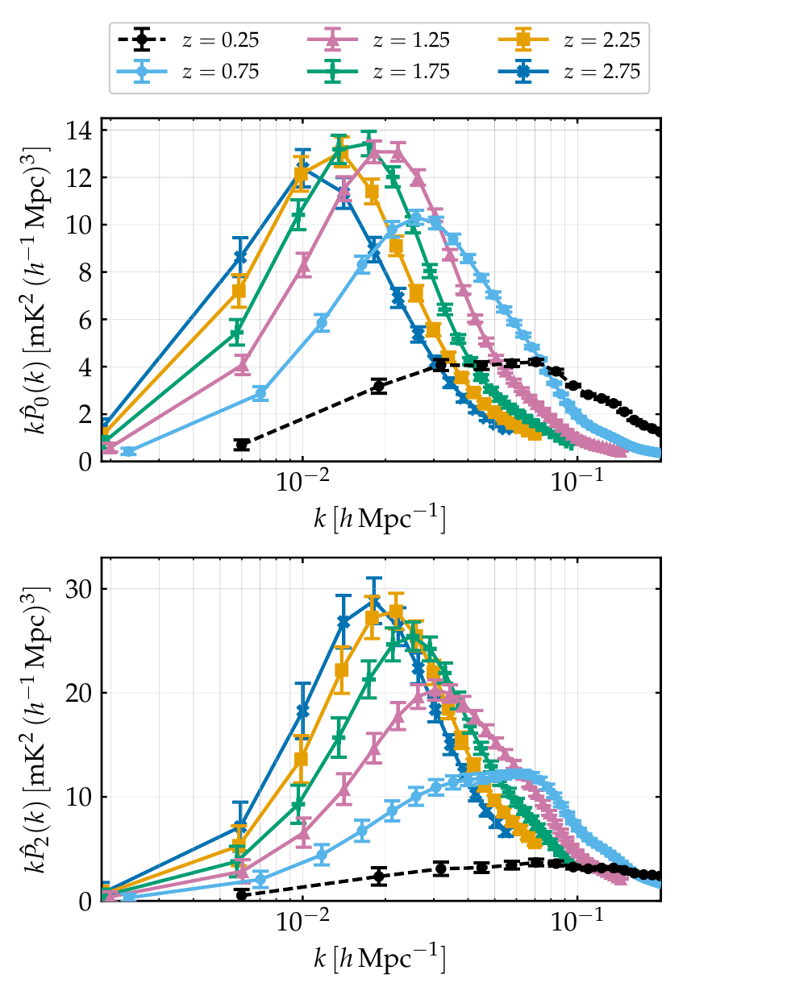
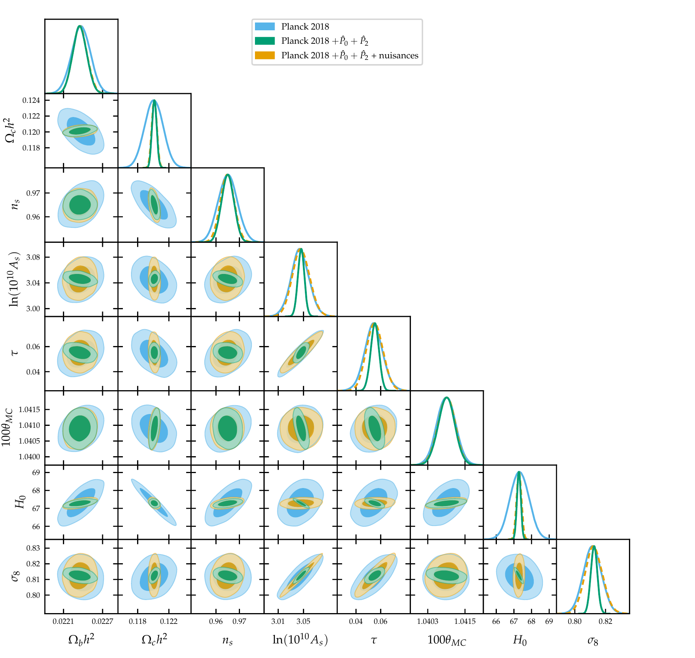

```{=html}
<div class="pagehead projhead">
  <div>
    <div class="tags"><span class="tag">Simulation</span><span class="tag">Bayesian inference</span><span class="tag">MCMC</span><span class="tag">Uncertainty quantification</span></div>
    <h1><em>What will the next giant radio telescope reveal?</em></h1>
    <p class="lead">A forecast of the cosmological constraints from 21cm intensity mapping with the SKA Observatory. I simulated the redshift-space power spectrum monopole and quadrupole in six redshift bins, implemented their likelihood with the full multipole covariance in an MCMC sampler, and assessed the constraining power alone and combined with Planck CMB data.</p>
  </div>
</div>
```

## The problem

The SKA Observatory, under construction in South Africa and Australia, will be one of the largest radio telescopes ever built. One of its goals is to map how neutral hydrogen, the most common element in the Universe, is distributed across billions of years of cosmic history. That map traces the invisible dark matter, and can be used to measure the basic parameters of our cosmological model.

Before a telescope like this collects any data, a key question is how much it will actually tell us, and whether it adds anything to the measurements we already have. Answering it means building a realistic simulation of data that does not exist yet, and running the full analysis on it as if it were real.

## What I built

**A realistic synthetic dataset.** I generated mock observations of the hydrogen signal in six slices of cosmic time, using the planned survey design of the telescope. The simulation includes the instrument's limitations: the blurring caused by the size of the telescope beam and the instrumental noise. These two effects set which scales carry useful information at each epoch.

**Informative summary statistics.** Instead of using a single measurement, I compressed the data into two complementary summary statistics, which capture how the signal varies with direction on the sky. Together they carry more information than either alone. I built their full covariance matrix, including the correlations between the two, and measured how much each choice changes the signal-to-noise.

**A custom likelihood in an MCMC pipeline.** I implemented the theoretical predictions and the likelihood for the new data in an existing MCMC code, and checked the pipeline by reproducing the published results of the Planck satellite. I then explored the posterior of the full cosmological model, both for the radio data alone and combined with Planck.

**Accounting for what we don't know.** The link between hydrogen and dark matter depends on astrophysics that is not well understood. I modelled this ignorance with additional nuisance parameters, marginalised over them, and checked how much information survives. To keep the sampling efficient, I replaced twelve free parameters with a smooth polynomial trend described by eight: the results were the same, and convergence was faster.

**Testing the limits of the model.** Finally, I extended the dataset to smaller scales, where the simple model breaks down and extra noise terms must be included, to see how much additional information could be gained.

## Results

```{=html}
<figure class="fig narrow">
  
  <figcaption><b>The simulated dataset.</b> The two summary statistics (top and bottom) measured in six slices of cosmic time, shown in different colours, with the expected measurement uncertainty on every point. This is the data the telescope is expected to deliver, built before the telescope exists.</figcaption>
</figure>
```

- **Competitive on its own.** The radio data alone constrain five of the six parameters of the standard cosmological model. Key quantities such as the expansion rate of the Universe are measured to about 7%, comparable with other independent probes.
- **Robust to unknown astrophysics.** Adding the nuisance parameters erases the information on the overall amplitude of the signal, as expected, but leaves the constraints on the expansion rate and the amount of dark matter unchanged. Splitting the data into many time slices is what makes the result robust.

```{=html}
<figure class="fig">
  
  <figcaption><b>Combining two datasets.</b> Joint and marginal posterior distributions for the cosmological parameters, from Planck alone (light blue), Planck plus the simulated radio data (green), and the same including the astrophysical nuisance parameters (orange). Smaller contours mean more precise measurements.</figcaption>
</figure>
```

- **Better together.** Combined with Planck, the radio data shrink the uncertainty on the expansion rate from 0.79% to 0.16%, and on the amount of dark matter from 0.99% to 0.25%, roughly a factor of four. The gain comes from the two datasets being uncertain in different directions: where one cannot distinguish between two parameters, the other can. In the figure, the elongated blue ellipses collapse into small green ones.
- **More scales, more information.** Including the smaller scales improves the radio-only measurement of the expansion rate to 0.49%, better than Planck alone.

## Techniques

```{=html}
<div class="skills">
  <div><h4>Simulation</h4><p>Generating realistic synthetic data with instrument effects and noise, to test an analysis before real data exist.</p></div>
  <div><h4>Inference</h4><p>Bayesian analysis, MCMC in high dimensions, marginalising over nuisance parameters, uncertainty quantification.</p></div>
  <div><h4>Data</h4><p>Designing summary statistics, building full covariance matrices, combining independent datasets in one likelihood.</p></div>
  <div><h4>Engineering</h4><p>Extending a large scientific codebase, writing custom likelihoods, reducing model dimensionality for faster convergence.</p></div>
</div>

<a class="btn paperbtn" href="https://academic.oup.com/mnras/article/521/3/3221/7070719">Read the full paper</a>
<br>
<a class="backlink" href="../projects.html">← All projects</a>
```
